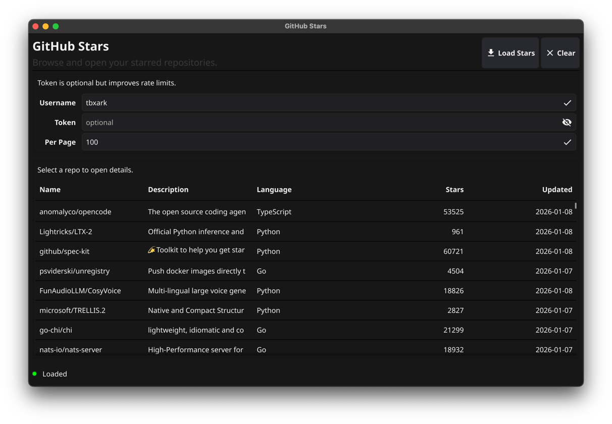

# gh-stars

A Fyne MVVM best-practice example using a GitHub Stars viewer as the sample app.



## What this project demonstrates

- **MVVM Architecture**: 5-layer separation (View → ViewModel → Service → Client → Domain)
- **Data Binding**: Automatic UI updates using Fyne's binding system
- **Thread Safety**: All UI updates on main thread, mutex-protected state
- **Window Management**: Centralized Navigator with deduplication
- **Context Cancellation**: Automatic cancellation of outdated requests
- **Component Reusability**: Shared widgets (CredentialsForm, StatusPanel)
- **Router Abstraction**: Interface-based navigation (no circular dependencies)
- **Testability**: Mock services with interface-based design

## Architecture Highlights

### Clean Separation of Concerns
```
Domain ← Service ← ViewModel ← View
   ↑        ↑
   └─ Client ────┘
```

- **No reverse dependencies**: UI never imports HTTP layer
- **Interface-based**: Services use Loader interfaces for easy mocking
- **Zero race conditions**: Verified with `go test -race ./...`

### Test Coverage
- Services: 7.7% (core logic tested)
- ViewModels: 42.1% (state management tested)
- All tests passing with zero race conditions

## Run

```bash
go run .
```

Token is optional, but recommended to increase GitHub API rate limits.

## Testing

```bash
# Run all tests
go test ./...

# With coverage
go test -cover ./...

# With race detection
go test -race ./...

# Generate HTML coverage report
go test -coverprofile=coverage.out ./...
go tool cover -html=coverage.out -o coverage.html
```

## Structure

- `main.go`: Entry point and wiring
- `internal/app/`: Use cases (stars / repos services)
  - `stars/`: Starred repositories loading
  - `repos/`: Repository details loading
- `internal/github/`: GitHub API client
- `internal/domain/`: Domain models (Repo, RepoDetails)
- `internal/ui/`: Fyne UI components
  - `stars/`: Stars list View/ViewModel
  - `details/`: Repository details View/ViewModel
  - `nav/`: Navigator (window management)
  - `route/`: Router interface (abstraction)
  - `widgets/`: Reusable components

## Documentation

- `docs/Architecture.md` - MVVM architecture overview
- `docs/Navigator.md` - Window management patterns
